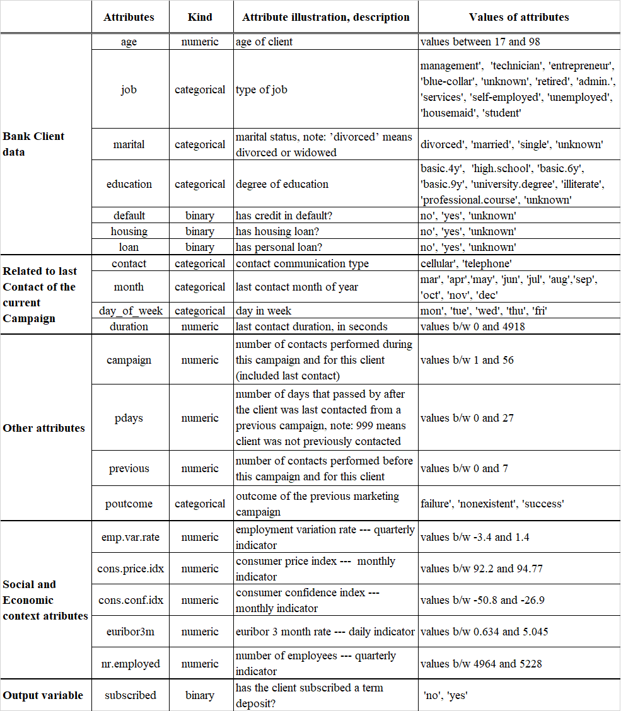

```{r setup, include=FALSE}
knitr::opts_chunk$set(echo = FALSE)
library(ggplot2)
library(ggpmisc)
library(ggcorrplot)
library(grid)
library(gridExtra)
library(reshape2)
library(ggpubr)
library(tibble)
library(cowplot)
library(vcd)
library(knitr)
library(kableExtra)
library(data.table)
```

------------------------------------------------------------------------

## Introduction

A Portuguese banking institution's direct marketing campaigns are covered by the dataset. The marketing campaigns were based on phone conversations. Often, it was necessary to make multiple frequent contacts with the same client in order to determine whether the product (in this case, bank term deposit) would be subscribed ('yes') or not ('no').

Our primary goal is to formulate descriptive statistics and visualization with the graphical tools avilable in R language(mainly, **ggplot2**).

## Dataset Information

```{r echo = FALSE}
loaded_data = read.csv(file = "bank_dataset.csv")
setDT(loaded_data)    # convert data.frame into data.table
```

Our data contains `r nrow(loaded_data)` observations and `r length(loaded_data)` attributes, where 11 are categorical (within them 4 are binary variables) and 10 are numerical attributes. The table below contains a portion of the analysed data and names of all the attributes, along with their types and values that they contains. 


<p align = "center" style="color:#777777 font-size:30px;">Fig 2: Attribute Description<br></p>

In this case, studying and analyzing socioeconomic attributes (i.e. **emp.var.rate**, **cons.price.idx**, **cons.conf.idx**, **euribor3m**, **nr.employed**) need a extensive knowledge of that specific domain and therefore beyond the purview of our limited descriptive study of this dataset.

Due to this, our exploratory data analysis we would be focusing on the remaining 16 attributes.

```{r}
loaded_data = loaded_data[,-c(16:20)]
kable(loaded_data[1:6,], caption = "Figure 1: Example of the dataset.", longtable=T, booktabs=T) %>% 
  kable_styling(font_size=7)
```

## Visualization

### Age
Summary of **Age** attribute.
```{r}
summary(loaded_data$age)
```

First feature is Age of clients, this is numeric features in range between 17 and 98 years old. We can see Bar plot of this data on *Figure 3* and next to it is the histogram of this values with pointed density and mean value. Histogram is prepared with bandwidth of 5 years. We can see that this plot is right-skewed, but also similar to normal distribution.

```{r warning=FALSE}
bar_plot = ggplot(data = loaded_data, aes(x = age)) +
  geom_bar(fill = "seagreen4", color = "seashell") +
  labs(title = "Bar Plot of Age", x = "Age", y = "Number of Clients")

mean_age <- mean(loaded_data$age)

hist_plot = ggplot(data = loaded_data, aes(x = age)) +
  geom_histogram(aes(y = ..density..),fill="turquoise1", color = "turquoise4", binwidth = 5) +
  geom_density(color = "deepskyblue4", lwd=1) +
  geom_vline(xintercept = mean_age, linetype = "dashed", color = "red", lwd = 1) +
  labs(title = "Histogram and Density of Age", x = "Age", y = "Density")

grid.arrange(bar_plot, hist_plot, nrow = 1, bottom = textGrob("Figure 3"))
```

Next, we compare box-plots of Age according to result of campaign. ’yes’ means that client subscribed a term deposit, ’no’ when didn’t do it. Result are presented on *Figure 4*. We see distribution for clients, who subscribed a term deposit is more diffused, but it is because people, who said 'yes' is less.
```{r}
plot <- ggplot(data = loaded_data, aes(x = subscribed, y = age)) +
  geom_boxplot(color = "deepskyblue4", fill = "turquoise1") +
  labs(title = "Box Plot of Age vs. Subscribed Result", x = "Subscribed Result", y = "Age")

# Create a ggplot object for the caption
caption <- ggplot(data = data.frame(x = 0, y = 0), aes(x = x, y = y)) +
  geom_text(label = "Figure 4: Box-plots of age for different results of campaign", hjust = 0, vjust = 0) +
  xlim(0, 1) + ylim(0, 1) +
  theme_void()

# Use grid.arrange() to combine the plot and caption objects into a single grid
grid.arrange(plot, caption, ncol = 1, heights = c(8, 0.5))
```

### Job
The second attribute is **Job**, it is categorical in type and takes 12 different categories of values i.e. ’management’, ’technician’, ’entrepreneur’, ’blue-collar’, ’unknown’, ’retired’, ’admin.’, ’services’, ’self-employed’, ’unemployed’, ’housemaid’, ’student’. The pie-chart represent the proportions of job categories within the clients.
```{r}
# Create a frequency table of the job attribute, sorted in a descending order
job_table <- table(loaded_data$job)

# Calculate the proportion of each level of the job attribute
job_proportions <- prop.table(job_table)

# Convert the proportions to percentages
job_percentages <- job_proportions * 100

# Format the percentages with 3 decimal places
job_percentages_formatted <- format(job_percentages, digits = 3, nsmall = 3)


# Create a data frame with the job type and count columns
job_summary = data.frame(job_type = names(job_table), count = job_table, percent = job_percentages_formatted)[-c(2)]
job_summary = job_summary[order(job_summary$percent, decreasing = TRUE),]
rownames(job_summary) = c(1:nrow(job_summary))
job_summary$percent = as.numeric(job_summary$percent)

grid.arrange(tableGrob(job_summary))

# Create a ggplot object for the pie chart
job_pie = ggplot(data = job_summary, aes(x = "", y = count.Freq, fill = job_type)) +
  geom_bar(stat = "identity", width = 1, color = "white") +
  coord_polar("y", start = 0) +
  labs(title = "Pie Chart of Job Attribute", x = "", y = "")
print(job_pie)

```

From the bar-plot below, we see that the job type that subscribed to a term deposit. The most of them comes from management, followed by technician, and blue-collar job holders has the least subscription to a term deposit. In later analysis we will treat ’unknown’ variables as missing values.

```{r}
job_subscribed <- data.frame(job = loaded_data$job, subscribed = loaded_data$subscribed, count = 1)

# Create a ggplot object for the bar plot
normal_stack <- ggplot(data = job_subscribed, aes(x = job, y = count, fill = subscribed)) +
  geom_bar(stat = "identity") +
  labs(title = "Stacked Bar Plot of Job Attribute vs Subscribed Result", x = "Job", y = "Subscription_count")+
  theme(axis.text.x = element_text(angle = 45, hjust = 1))

print(normal_stack)
```

### Marital
The third attribute is marital, which is categorical in kind and has range of the following values: ’divorced’, ’married’, ’single’.
```{r}
# Create a pivot table of the marital and subscribed columns that shows the proportion of each combination of values
# dropping the "unknown" row
marital_subscribed_table <- as.data.frame.matrix(table(loaded_data$marital, loaded_data$subscribed)[-4,])
# Print the pivot table
```

From the bar-plot of marital below, the 'married' has the highest subscription to a term deposit
and also has the highest unsubscribed to a term deposit, because marriage people are the biggest group of analysed clients. The 'single' has the second largest subscription and has the second largest unsubscribed to a term deposit with a count of about 9948. In pie charts we can see percentage ratio of individual marital categories for various results of final campaigns.

```{r}
marital_subscribed <- data.frame(marital = loaded_data$marital, subscribed = loaded_data$subscribed, count = 1)

# Create a ggplot object for the bar plot
plot <- ggplot(data = marital_subscribed, aes(x = marital, y = count, fill = subscribed)) +
  geom_bar(stat = "identity") +
  labs(title = "Stacked Bar Plot of Marital Attribute vs Subscribed Result", x = "Marital Status", y = "Subscription_count")

# Print the plot
print(plot)
```

### Education
The fourth attribute in the data set is **Education**, which is categorical in kind and has the following values of attribute: "basic.4y", "basic.6y", "basic.9y", "high.school", "illiterate", "professional.course", "university.degree" and "unknown" . In the following table we see that the highest number of subscribed and unsubscribed to the bank term deposit belong to 'university.degree' education category, followed by 'high.school' education. The 'illi    terate' has the least number of subscribed and unsubscribed to the bank term deposit.

```{r}
education_subscribed_table <- table(loaded_data$education, loaded_data$subscribed)
education_subscribed_percentages <- education_subscribed_table / sum(education_subscribed_table) * 100
education_subscribed_percentages <- round(education_subscribed_percentages, 3)

education_pivot = cbind.data.frame(as.data.frame.matrix(education_subscribed_table), as.data.frame.matrix(education_subscribed_percentages))

colnames(education_pivot) = c("no_count","yes_count","no_%","yes_%")
grid.arrange(tableGrob(education_pivot))
```

```{r}
ggplot(data = loaded_data, aes(x = education, fill = subscribed)) +
  geom_bar(stat = "count") +
  labs(title = "Stacked Bar Plot of Education vs Subscribed", x = "Education") +
  theme(axis.text.x = element_text(angle = 45, hjust = 1))

```

### Default, housing, loan vs Subscribed

In the tables below we can see the numbers(left table) and percentages(right table) of clients with ("yes") and without ("no") any loan default (**default**), housing (**housing**), any sort of loan (**loan**) and subscription to the bank term deposit (**subscribed**).
```{r}
default_housing_loan_subscribed_table <- table(loaded_data$default)

house = table(loaded_data$housing)
default_housing_loan_subscribed_table = rbind(default_housing_loan_subscribed_table, house)

loan = table(loaded_data$loan)
default_housing_loan_subscribed_table = as.data.frame.matrix(rbind(default_housing_loan_subscribed_table, loan))

subs = rbind(as.data.frame.numeric(table(loaded_data$subscribed)), unknown=c(0))[c("no","unknown","yes"),]
default_housing_loan_subscribed_table = rbind(default_housing_loan_subscribed_table, subs)

default_housing_loan_subscribed_prop_table = (default_housing_loan_subscribed_table / rowSums(default_housing_loan_subscribed_table))*100
default_housing_loan_subscribed_prop_table = data.frame(lapply(default_housing_loan_subscribed_prop_table, function(x) round(x,2)))

rownames(default_housing_loan_subscribed_table) = c("default","housing","loan","subscribed")
rownames(default_housing_loan_subscribed_prop_table) = c("default","housing","loan","subscribed")
colnames(default_housing_loan_subscribed_prop_table) = c("no_%", "unknown_%", "yes_%")

grid.arrange(tableGrob(default_housing_loan_subscribed_table), tableGrob(default_housing_loan_subscribed_prop_table), nrow = 1)
```

### Contact

Here we consider the attribute **contact**, it is categorical in kind and has its values of attributes to be "cellular", "telephone" and "unknown". The mosaic plot in figure below shows the means by which the clients were contacted and the number of clients who were contacted have they subscribed or did not subscribe to the bank term deposit.The plot clearly shows that the number of clients that were contacted but did not subscribe was far more than the clients who subscribed to the bank term deposit.

```{r}
# Subset the data to only include the contact and subscribed variables
subset_data <- subset(loaded_data, select = c("contact", "subscribed"))

contingency_table <- table(subset_data)
# Create a mosaic plot
mosaicplot(contingency_table, color = TRUE, shade = TRUE, 
main = "Mosaic Plot of Contact vs Subscribed", xlab = "Contact", ylab = "Subscribed")

```

### Day & Month

```{r}
# Install and load the vcd package

# Subset the data to only include the month, day_of_week and subscribed variables
subset_data <- subset(loaded_data, select = c("month", "day_of_week", "subscribed"))

# Create a contingency table of the month, day_of_week and subscribed variables
contingency_table <- table(subset_data)

# Create a mosaic plot
mosaicplot(contingency_table, color = TRUE, shade = TRUE,  
           main = "Mosaic Plot of Month, Day of Week and Subscribed", xlab = "Month and Day of Week", ylab = "Subscribed")

```
## Conclusion
